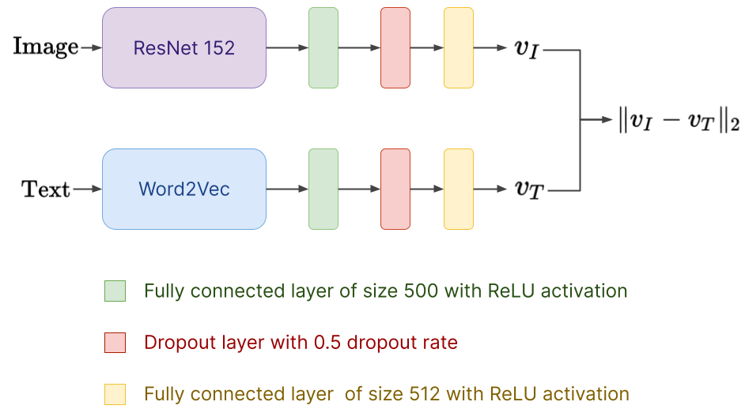
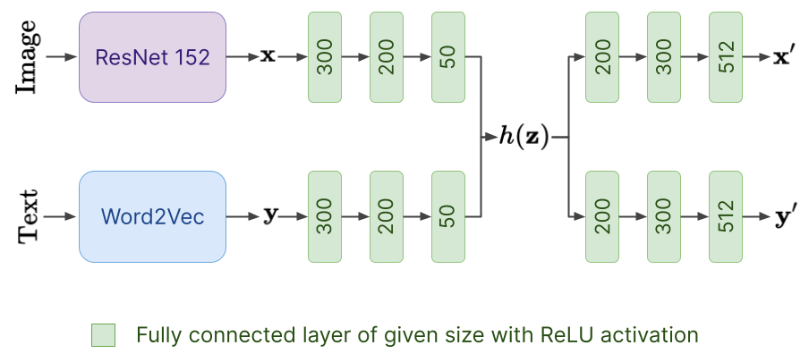
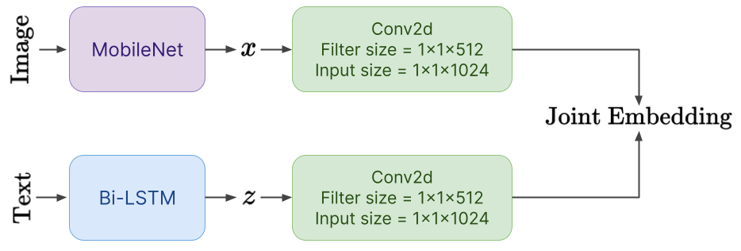

# Image_Text_Retrieval

## Motivation
Cross-modal learning involves information obtained from morethan one modality. Fashion clothing industry is one such field whereproduct retrieval based on multiple modalities such as image and text has become important. In the online fashion industry, being able to search for a product that matches either an image queryor a text query is in high demand

 

## Our Work
In this work, we implement different cross-modal learning schemes such as Siamese Network, Correlational Network and Deep Cross-Modal Projection Learning model and study their performance. We also propose a modified Deep Cross-Modal Projection Learning model that uses a different image feature extractor. We evaluate the model’s performance on image-text retrieval on afashion clothing dataset.

 

## Instructions to run the code

The repository contains 3 folders each of which contains the source code for different model architectures we experimented with. Specifically these are:
* Deep CMPL model
* Siamese Network
* Correlational Network

Each of the folders contains a dedicated Readme detailing the instructions to run the source code for each model. The source code is well commented and readable.

 
 

# Theoretical Details

## Experimented models

 

### Siamese Network
Siamese Network is a neural network architecture that containstwo or more identical sub-networks having the same weights andparameters. It is commonly used to find the similarity of theinputs by comparing its feature vector outputs. We implementeda two-branch neural network inspired from Siamese Network ar-chitecture and used a contrastive loss function for our task.

 

#### *Network Architecture*

 

### Correlational Network
Correlational Network is an autoencoder based approach thatexplicitly maximises correlation between image and text embeddedvectors in addition to minimising the error of reconstructing thetwo views(image and text)[16]. This model also has two branches -one for images and one for text, but at the same time it also has anencoder and decoder.

 

#### *Network Architecture*

 

### DEEP CMPL Network
Cross-Modal Projection Learning[21] includes Cross-Modal Pro-jection Matching (CMPM) loss for learning discriminative image-text embeddings. This novel image-text matching loss minimizesthe relative entropy between the projection distributions and thenormalized matching distributions. 

 

#### Modified Deep CMPL
We modified the Deep Cross-Modal Projection Learning modelby using the EfficientNet [17] architecture instead of MobileNet[6] as the image feature extractor. EfficientNet is a recently pro-posed convolutional neural architecture which outperforms otherstate-of-the-art convolutional neural networks both in terms ofefficiency and accuracy

 

#### *Network Architecture*

